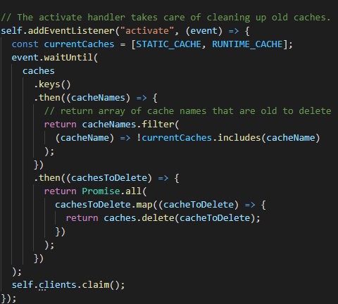

# Budget Tracker
This is a budget tracker app that you can use in online or offline mode and is deployed using Heroku.

**Technologies used**
I used a mongoose schema to track the transactions it takes in name, date and value for each transaction model.  Each transaction is routed with get and post routes using express, with a 404 error if the transaction has not been created. Then after the user inputs the transaction it populates the transaction model with the data and shows it on a graph. 
The graph contains a list of transactions that can be executed both online and offline due to the cached information in the database using the service worker. 

## Built With

* [Object Store](https://developer.mozilla.org/en-US/docs/Web/API/IDBObjectStore/add)
* [Cache](https://developer.mozilla.org/en-US/docs/Web/API/Cache)
* [Service Workers](https://developer.mozilla.org/en-US/docs/Web/API/ServiceWorker)
* [Mongoose Schema](https://mongoosejs.com/docs/guide.html)

## Deployed Link

* [Heroku Deployment](https://git.heroku.com/budgettrackscool.git)
* [Github Link](https://github.com/Alix1713/budget)

## Author
* **Alix Friedman** 

##LinkedIn and Github

- [LinkedIn](https://www.linkedin.com/in/alix1713/)
- [GitHub](https://github.com/Alix1713)
